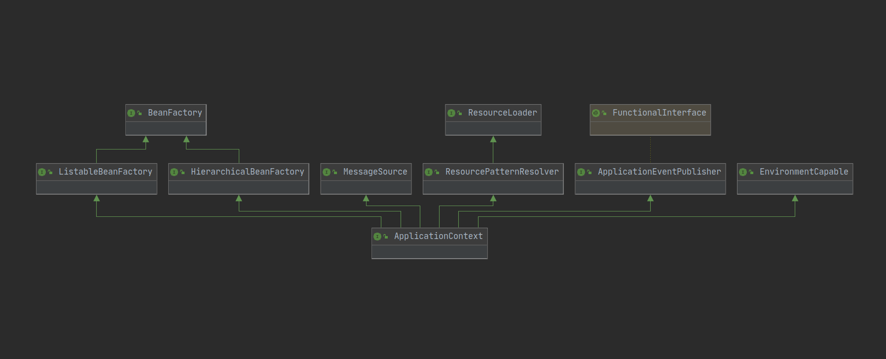

# 深入 Spring IoC - 1.1 总概览

[TOC]

# 概述

Inversion of Control (IoC,控制反转) [IoC 更多内容](https://github.com/LeonChen1024/Excellent-Javaer/blob/master/principle/ioc.md),这是一个设计原则,可以减少程序的耦合度.而IoC通常是和 dependency injection (DI,依赖注入) 一起出现的,可以说DI是实现IoC原则的一种主要方式.通过从外部注入依赖到使用者,使得控制创建依赖的职责反转到了外部,使得代码的耦合度减少,灵活度和扩展能力得到提高. 

Spring中提供了这种模式的实现,通过把类交给IoC容器,并告诉它你是什么,那么当有类需要用到你的时候Spring 就可以从容器中获取并注入给调用者.

## IoC 容器

在 `spring-framework` 项目中, `spring-beans` 模块下的 `org.springframework.beans` 包和 `spring-context` 模块下的 `org.springframework.context` 包是 Spring 的IoC的基础所在. 所以如果要了解Spring 中的IoC容器的话,这两个包是值的阅读的.

`BeanFactory` 接口提供了一种高级配置机制,能够管理任何类型的对象.Spring中使用原型设计模式或者单例设计模式的变种(在工厂作用域中是单例的)来管理bean实例. `ApplicationContext` 是 `BeanFactory` 的一个子接口.

如图所示

 `ApplicationContext` 在 `BeanFactory` 的基础上添加了一些额外内容,比如:

- 更方便和 Spring 的AOP 集成
- 用于国际化的消息资源处理
- 事件发布
- 提供了应用层特定的上下文,比如给web应用使用的 `WebApplicationContext`

也就是说 `ApplicationContext` 在 `BeanFactory` 的基础上添加了很多面向企业级开发的功能.它是包含了 `BeanFactory` IoC 容器的功能.我们一般使用它就可以了.

## Beans

在Spring 中,构成应用的骨架并且被 Spring IoC 容器管理的对象叫做 bean. bean对象会被IoC容器实例化,组装和管理.除此之外,bean也是你应用中的简单对象.bean 和它依赖都是通过容器中的配置元数据反射而来的.

